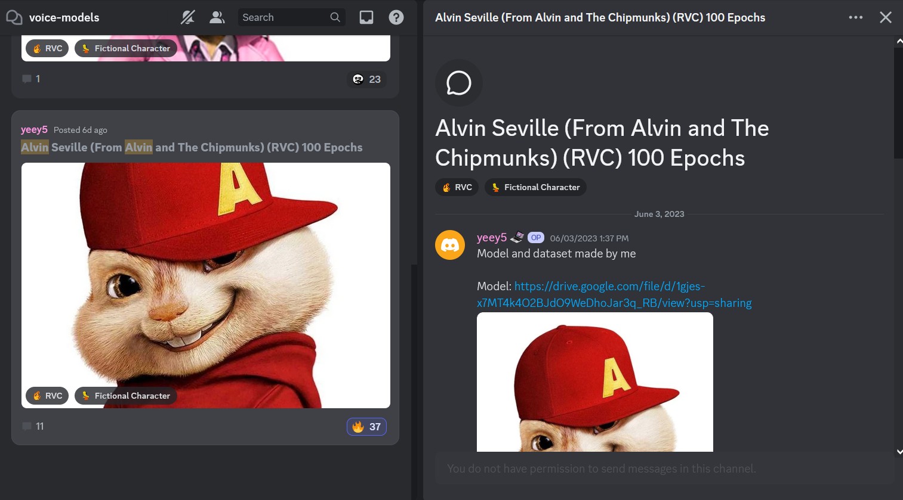
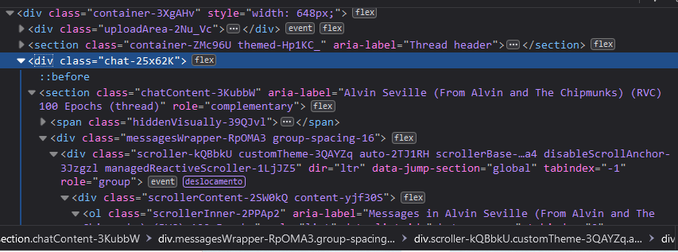

# **Voice Model Parser**

## **Description**

As the [AI Hub](discord.gg/aihub "AI Hub") discord server community continues to grow in size, keeping track of all the new models has become increasingly challenging. To simplify this process, this project aims to extract essential information, such as the model name, epoch, download link, and other relevant details, from model posts and save them to files.

---

## **Requisites**

I used `python 3.11`, but it should work with other versions. The only required module is **Beautiful Soup** which can be installed with the following command:

```bash
pip install beautifulsoup4
```

---

## **Usage**

**Step 1:** In the `voice-model` channel, click on a post to show it on the right side of the screen.



**Step 2:** Open the browser developer tools and find the `div` element with the class `chat-25x62K`, right click on it and select copy outer HTML.



> Note: If you'd like you can copy the code starting from the `body` element. However, keep in mind that as you scroll down the page, the previous posts will still be included. This means that the resulting files will end up being larger in size.

**Step 3:** Paste the copied code in a text editor and save it with `.html` extension and then put it in a folder named "pages" in the same directory where the `main.py` file is located.

> Note: Create this folder if it's the first time running the script.

**Step 4:** Repeat steps 2 and 3 for each page that you want to analyze. Once you have gathered all the necessary pages, run the `main.py` file. This file is responsible for batch analyzing the pages and extract data.

If everything goes well, the extracted data will be saved in a file called `data.json` in the same directory as the `main.py`. However, if it fails to parse the data, all the extracted text from the page will be saved in a text file within the `dumps` folder.

---

## **Using programatically**

### DiscordForumParser

This class is responsible for extracting general info from the forum post. It expects a `BeautifulSoup` object to be passed to it's constructor.
 
```python
from package.parsers.forum import DiscordForumParser
from package.utils.helpers import load_html

html_file = HTML_DIR / 'alvin.html'
html_data = load_html(html_file)  # Returns a BeautifulSoup object

forum_parser = DiscordForumParser(html_data)

print('Title:', forum_parser.title)
print('Tags:', forum_parser.tags)
print('Total reactions:', forum_parser.reactions_count)
print('Content:\n', forum_parser.content)
```

Output:

```yaml
Title: Alvin Seville (From Alvin and The Chipmunks) (RVC) 100 Epochs
Tags: ['RVC', 'Fictional Character']
Total reactions: 55
Content:
 Model and dataset made by me

Model: https://drive.google.com/file/d/1gjes-x7MT4k4O2BJdO9WeDhoJar3q_RB/view?usp=sharing
```

### VoiceModelParser

This class is responsible for extracting specific info about a voice model, such as epochs, steps and so on... It expects a `DiscordForumParser` object to be passed to it's constructor.

```python
from package.parsers.voice_model import VoiceModelParser

forum_parser = DiscordForumParser(html_data)
model_parser = VoiceModelParser(forum_parser)

print('Name:', model_parser.name)
print('Type:', model_parser.category)
print('Links:', model_parser.links)

```

Output:

```yaml
Name: Alvin Seville (From Alvin and The Chipmunks)
Type: RVC
Links: ['https://drive.google.com/file/d/1gjes-x7MT4k4O2BJdO9WeDhoJar3q_RB/view?usp=sharing']
```

This class can also return a `VoiceModel` object which has even more specific details.

```python
model_parser = VoiceModelParser(forum_parser)

voice_model = model_parser.extract_model()

print('Title:', voice_model.title)
print('Author:', voice_model.author)
print('Tags:', voice_model.tags)
print('Has group:', voice_model.has_group)
print('Group:', voice_model.group)
print('Type:', voice_model.type)
print('Epochs:', voice_model.epochs)
print('Steps:', voice_model.steps)
print('Download link:', voice_model.download_link)
```

Output:

```yaml
Title: Alvin Seville (From Alvin and The Chipmunks)
Author: yeey5
Tags: ['RVC', 'Fictional Character']
Has group: True
Group: Alvin and The Chipmunks
Type: RVC
Epochs: 100
Steps: -1  # returns -1 if not found or not provided
Download link: https://drive.google.com/file/d/1gjes-x7MT4k4O2BJdO9WeDhoJar3q_RB/view?usp=sharing
```

---

## **Limitations**

- Currently only supports extracting data from RVC model posts.
- When searching for download links in the forum post replies it's only able to find links from Google drive or Mega.
- Only saves data to `json` if there's a single download link found in the forum post or in the replies.
